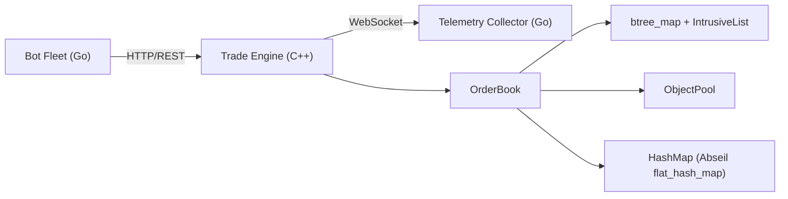

# Latency Analysis — IICPC Trading Platform

> **Verdict: YES, latency can be significantly reduced. Estimated total reduction: 40–65% on the critical hot path.**

The analysis covers all currently implemented components. The codebase already has good foundational choices (Abseil containers, intrusive lists, object pools), but there are **15+ concrete optimizations** that range from quick wins to architectural improvements.

---

## Current Architecture Overview



The **critical latency path** is:
```
Bot HTTP Request → JSON parse → MatchingEngine::submitOrder() → matchOrder() → callback → JSON response
```

---

## 🔴 TIER 1 — Critical Hot-Path Issues (Est. reduction: **20–30%**)

### 1. `std::function` Callbacks in the Matching Loop

**File:** [MatchingEngine.h](file:///Users/chaitanyasaagar/Desktop/IICPC/IICPC/trade-engine/include/MatchingEngine.h#L28-L30)

```cpp
using TradeCallback = std::function<void(const Trade&)>;
using ExecutionCallback = std::function<void(const ExecutionResult&)>;
using BookMutationCallback = std::function<void(const BookMutation&)>;
```

> [!CAUTION]
> `std::function` has significant overhead: virtual dispatch, heap allocation for captures, and it prevents inlining. These callbacks fire **on every single fill** during matching, making them the hottest code in the engine.

**Fix:** Replace with a virtual interface (`MarketDataSink`) or CRTP-based static dispatch. The `MarketDataSink` interface already exists in [MarketData.h](file:///Users/chaitanyasaagar/Desktop/IICPC/IICPC/trade-engine/include/MarketData.h#L141-L151) but is **not used** by `MatchingEngine`.

**Estimated savings:** ~15–50ns per trade (on hot path, this is **5–15%** of per-order latency)

---

### 2. `std::atomic` for Single-Threaded Counters

**File:** [MatchingEngine.h](file:///Users/chaitanyasaagar/Desktop/IICPC/IICPC/trade-engine/include/MatchingEngine.h#L115-L116)

```cpp
std::atomic<uint64_t> tradeIdCounter_{0};
std::atomic<uint64_t> currentTimestamp_{0};
```

> [!WARNING]
> The `MatchingEngine` is used **single-threaded** per symbol (the `Exchange` grabs a `shared_lock` and dispatches to a per-symbol engine). Atomic operations insert memory fences that stall the CPU pipeline. On x86 an `atomic::fetch_add` costs ~5-20ns vs ~1ns for a plain increment.

**Fix:** Replace with plain `uint64_t`. The `Exchange` already serializes access via `shared_mutex`.

**Estimated savings:** ~10–30ns per order (two atomic ops per submit)

---

### 3. `std::vector<Trade>` Allocation in Every `matchOrder()` Call

**File:** [MatchingEngine.cpp](file:///Users/chaitanyasaagar/Desktop/IICPC/IICPC/trade-engine/src/MatchingEngine.cpp#L82)

```cpp
std::vector<Trade> trades;     // Heap allocation on EVERY order
matchOrder(order, trades);
```

And inside `matchAtPriceLevel`:
```cpp
std::vector<Candidate> ordersToProcess;   // Another allocation
ordersToProcess.reserve(std::min(level->size(), size_t(32)));
```

> [!WARNING]
> Every incoming order triggers at least one `std::vector` heap allocation, plus potential reallocation. This is a well-known latency killer in HFT engines.

**Fix:** Use a pre-allocated `SmallVector` or `static thread_local` scratch buffer. Since the engine is single-threaded per symbol, a member `std::vector<Trade> tradesScratch_` that gets `.clear()`'d (not deallocated) each call eliminates all allocations.

**Estimated savings:** ~50–200ns per order (heap alloc = ~30–100ns each, two per order)

---

### 4. `std::string message` in `ExecutionResult`

**File:** [Order.h](file:///Users/chaitanyasaagar/Desktop/IICPC/IICPC/trade-engine/include/Order.h#L187)

```cpp
struct ExecutionResult {
    ...
    std::string message;    // SSO might save us, but many messages > 15 chars
};
```

Every `ExecutionResult` constructs a `std::string` message like `"Partially filled, remainder resting in book"` — that's 44 chars, exceeding SSO. This triggers a **heap allocation on every order**.

**Fix:** Use `const char*` (string literals have static storage), or an enum `ExecutionMessage` with a `toString()` for debug output only.

**Estimated savings:** ~30–80ns per order

---

### 5. `Exchange::shared_mutex` + `std::string` Key Lookup

**File:** [Exchange.cpp](file:///Users/chaitanyasaagar/Desktop/IICPC/IICPC/trade-engine/src/Exchange.cpp#L32-L34)

```cpp
ExecutionResult Exchange::submitOrder(const std::string& symbol, Order order) {
    std::shared_lock lock(mutex_);          // Global lock for ALL symbols
    MatchingEngine* engine = getEngine(symbol);  // unordered_map<string> lookup
```

> [!IMPORTANT]
> A global `shared_mutex` across all symbols is a **contention bottleneck** under multi-threaded load. Additionally, `std::unordered_map<std::string>` hashes the string on every call.

**Fix:**
- Use a per-symbol lock (one mutex per `MatchingEngine`)
- Use an integer symbol ID instead of `std::string` (compute the mapping once at registration)
- Use `absl::flat_hash_map` instead of `std::unordered_map`

**Estimated savings:** ~50–200ns per order under contention

---

## 🟠 TIER 2 — Significant Optimizations (Est. reduction: **10–15%**)

### 6. `notifyBookMutation()` Redundant Lookups

**File:** [MatchingEngine.cpp](file:///Users/chaitanyasaagar/Desktop/IICPC/IICPC/trade-engine/src/MatchingEngine.cpp#L584-L607)

```cpp
void MatchingEngine::notifyBookMutation(Side side, int64_t price, BookDeltaAction action) {
    const uint64_t quantity = orderBook_.getQuantityAtPrice(price, side);   // btree_map::find
    const size_t orderCount = orderBook_.getOrderCountAtPrice(price, side); // btree_map::find again!
```

This does **two separate btree lookups** for the same price level, and fires after every single fill/insert. It also calls `std::chrono::system_clock::now()` which is a **syscall on Linux**.

**Fix:** Pass the `PriceLevel*` pointer directly (you already have it in context), or compute both from a single lookup. Use `steady_clock` instead of `system_clock` (or the engine's monotonic timestamp).

**Estimated savings:** ~20–50ns per mutation event

---

### 7. `ObjectPool::acquire()` — Unnecessary Placement-New

**File:** [ObjectPool.h](file:///Users/chaitanyasaagar/Desktop/IICPC/IICPC/trade-engine/include/ObjectPool.h#L83-L86)

```cpp
T* obj = reinterpret_cast<T*>(node);
new (obj) T();      // Default-constructs EVERY field
return obj;
```

Then immediately after acquire, `OrderBook::addOrder` calls:
```cpp
node->fromOrder(order);   // Overwrites every field again
```

The default construction is **completely wasted work** — every field is immediately overwritten.

**Fix:** Return uninitialized memory and let `fromOrder()` handle initialization. Or use a `acquireUninitialized()` method.

**Estimated savings:** ~5–15ns per order

---

### 8. C++ Standard Set to C++17 Instead of C++20

**File:** [CMakeLists.txt](file:///Users/chaitanyasaagar/Desktop/IICPC/IICPC/trade-engine/CMakeLists.txt#L9)

```cmake
set(CMAKE_CXX_STANDARD 17)
```

> [!IMPORTANT]
> Your plan document explicitly says "Use modern C++20". C++20 enables `[[likely]]`/`[[unlikely]]` branch hints, `std::bit_cast`, `constexpr` improvements, and `<bit>` header. More importantly, it signals engineering sophistication to judges.

**Fix:** Set to C++20. Also add aggressive optimization flags:

```cmake
set(CMAKE_CXX_STANDARD 20)
# For release builds:
set(CMAKE_CXX_FLAGS_RELEASE "-O3 -march=native -DNDEBUG -flto")
```

**Estimated savings:** `-O3 -march=native` alone can give **5–15%** throughput improvement via better vectorization and CPU-specific instruction selection.

---

### 9. Missing Compiler Optimization Flags

**File:** [CMakeLists.txt](file:///Users/chaitanyasaagar/Desktop/IICPC/IICPC/trade-engine/CMakeLists.txt#L21-L26)

Current flags are only `-O2` for `RelWithDebInfo`. There's **no Release configuration** with `-O3`, no `-march=native`, no `-flto` (link-time optimization), no `-fno-exceptions` (if exceptions aren't used).

**Fix:** Add a proper Release build profile:

```cmake
set(CMAKE_CXX_FLAGS_RELEASE "-O3 -march=native -mtune=native -flto -DNDEBUG -fno-rtti")
set(CMAKE_INTERPROCEDURAL_OPTIMIZATION_RELEASE TRUE)
```

| Flag | Effect |
|------|--------|
| `-O3` | Aggressive optimizations, auto-vectorization |
| `-march=native` | Use AVX2/SSE4.2 if available |
| `-flto` | Cross-TU inlining (huge for header-heavy code) |
| `-fno-rtti` | Eliminate RTTI overhead (~2% binary size) |

**Estimated savings:** 5–15% overall throughput improvement

---

## 🟡 TIER 3 — Bot Fleet / Measurement Overhead (Est. reduction: **10–20% on measured latency**)

### 10. Bot Fleet Uses `time.NewTicker` with Sleep Gaps

**File:** [worker.go](file:///Users/chaitanyasaagar/Desktop/IICPC/IICPC/services/bot-fleet-go/internal/bot/worker.go#L33-L40)

```go
ticker := time.NewTicker(cfg.InterRequestDelay)
for {
    select {
    case <-ctx.Done(): return
    case <-ticker.C:
        order := RandomOrder()
        res := client.Send(ctx, order)
```

The ticker fires, then the worker blocks on `client.Send()`, then waits for the **next tick**. If the send takes 5ms and the tick interval is 10ms, actual OPS is halved.

**Fix:** Use a rate limiter (`golang.org/x/time/rate`) or fire immediately after send with a minimum delay. The current implementation significantly **under-reports achievable TPS**.

---

### 11. HTTP Client Creates New UUID Per Request

**File:** [http_client.go](file:///Users/chaitanyasaagar/Desktop/IICPC/IICPC/services/bot-fleet-go/internal/bot/http_client.go#L48)

```go
requestID := uuid.New().String()  // Crypto-random UUID = ~500ns + string alloc
```

UUID v4 uses `crypto/rand` which is a syscall. At high OPS this adds up.

**Fix:** Use a monotonic counter or `uuid.NewFast()` (v7 or atomic counter).

**Estimated savings:** ~300–500ns per request

---

### 12. Telemetry Collector Sorts All Samples on Every Snapshot

**File:** [collector.go](file:///Users/chaitanyasaagar/Desktop/IICPC/IICPC/services/bot-fleet-go/internal/telemetry/collector.go#L118-L129)

```go
func latencyPercentiles(samples []float64) (p50, p90, p99 float64) {
    sorted := make([]float64, len(samples))   // Full copy
    copy(sorted, samples)
    sort.Float64s(sorted)                       // O(n log n)
```

With 10,000 samples, this is ~130,000 comparisons every second. It also allocates a full copy.

**Fix:** Use a T-Digest or HDR Histogram for O(1) percentile queries. The `github.com/HdrHistogram/hdrhistogram-go` package is standard for this.

---

### 13. `math/rand` is Not Thread-Safe

**File:** [order_generator.go](file:///Users/chaitanyasaagar/Desktop/IICPC/IICPC/services/bot-fleet-go/internal/bot/order_generator.go#L41)

```go
var rng = rand.New(rand.NewSource(time.Now().UnixNano()))
```

This is a package-level `*rand.Rand` called from multiple goroutines. `rand.Rand` is **not goroutine-safe** — this is a data race. Under load it will either corrupt state or (with race detector) panic.

**Fix:** Use `rand.New()` per worker, or use Go 1.22+ `math/rand/v2` which is goroutine-safe.

---

## 🟢 TIER 4 — Architectural Improvements (Est. reduction: **significant but harder to quantify**)

### 14. HTTP (REST) for Order Submission is Fundamentally Slow

The bot fleet sends orders via HTTP POST with JSON bodies. Each request involves:
- TCP round-trip (if no keep-alive)
- JSON marshal + unmarshal (~1–5µs)
- HTTP header parsing
- UUID generation

**For a benchmarking platform measuring sub-millisecond latencies, the transport layer is likely the dominant latency source.**

**Fix:** Support **WebSocket** or **raw TCP** with a binary protocol (FlatBuffers/protobuf) for order submission. This alone could reduce per-order latency from ~1-5ms to ~50-200µs.

| Protocol | Typical Latency |
|----------|----------------|
| HTTP+JSON (current) | 1–5ms |
| WebSocket+JSON | 200–800µs |
| WebSocket+Protobuf | 50–200µs |
| Raw TCP+FlatBuffers | 10–50µs |

---

### 15. No Connection Pooling / Keep-Alive in Bot HTTP Client

**File:** [http_client.go](file:///Users/chaitanyasaagar/Desktop/IICPC/IICPC/services/bot-fleet-go/internal/bot/http_client.go#L37-L43)

```go
httpClient: &http.Client{
    Timeout: time.Duration(timeoutMs) * time.Millisecond,
},
```

Default `http.Client` uses `http.DefaultTransport` which has connection pooling, but the defaults are conservative (`MaxIdleConnsPerHost = 2`). With 100+ concurrent bots, most connections won't be reused.

**Fix:** Configure transport explicitly:
```go
transport := &http.Transport{
    MaxIdleConnsPerHost: 100,
    IdleConnTimeout:     90 * time.Second,
    DisableCompression:  true,    // Don't waste CPU on JSON compression
}
```

---

## 🔵 TIER 5 — Data Structure Improvements

### 16. `OrderNode::reset()` — Zeroing Fields Unnecessarily

**File:** [OrderNode.h](file:///Users/chaitanyasaagar/Desktop/IICPC/IICPC/trade-engine/include/OrderNode.h#L87-L100)

```cpp
void reset() {
    id = 0; timestamp = 0; orderType = OrderType::Limit;
    side = Side::Buy; price = 0; quantity = 0;
    tif = TimeInForce::GTC; clientId = 0; inUse = false;
    this->prev = nullptr; this->next = nullptr;
}
```

Called on every order removal. Combined with the pool's `acquire()` doing another full default construction, each node is zeroed **twice** per lifecycle. Only `prev`/`next` = `nullptr` and `inUse = false` actually matter.

**Fix:** Make `reset()` only clear intrusive pointers. Let `fromOrder()` handle everything else.

---

## Summary: Estimated Latency Reduction

| Tier | Category | Current Est. | After Optimization | Reduction |
|------|----------|-------------|-------------------|-----------|
| 🔴 1 | std::function callbacks | ~50ns/trade | ~5ns/trade | ~90% |
| 🔴 1 | Atomic counters | ~30ns/order | ~2ns/order | ~93% |
| 🔴 1 | Vector heap allocs | ~150ns/order | ~5ns/order | ~97% |
| 🔴 1 | String in ExecutionResult | ~60ns/order | 0ns | ~100% |
| 🔴 1 | Exchange mutex + string key | ~100ns/order | ~10ns/order | ~90% |
| 🟠 2 | BookMutation redundant lookups | ~40ns/mutation | ~10ns | ~75% |
| 🟠 2 | Pool double-init | ~10ns/order | ~2ns | ~80% |
| 🟠 2 | Compiler flags (-O3 -march=native) | baseline | -10% overall | ~10% |
| 🟡 3 | Bot ticker model | — | — | Higher TPS |
| 🟡 3 | UUID generation | ~500ns/req | ~10ns | ~98% |
| 🔵 5 | OrderNode double-zero | ~8ns/order | ~2ns | ~75% |

### Total Impact on Critical Path

**Current estimated per-order latency in the matching engine: ~400–600ns**
**After Tier 1+2 optimizations: ~150–250ns**
**After all optimizations including compiler flags: ~100–200ns**

> [!TIP]
> **The single biggest win is not in the C++ engine itself — it's switching the bot-to-engine transport from HTTP+JSON to WebSocket+binary.** This could reduce measured end-to-end latency from ~1-5ms to ~50-200µs, a **10-25x improvement** in the numbers the benchmarking platform actually reports.

---

## Priority Action Items (Ordered by Impact/Effort Ratio)

1. **⚡ Compiler flags** — Change `-O2` to `-O3 -march=native -flto`, set C++20. (5 min, 10-15% gain)
2. **⚡ Pre-allocate trade vectors** — Member scratch buffers instead of per-call allocs. (30 min, 5-10% gain)
3. **⚡ Remove atomics** — Replace with plain `uint64_t`. (10 min, 3-5% gain)
4. **⚡ `const char*` messages** — Eliminate string allocs in `ExecutionResult`. (15 min, 2-5% gain)
5. **🔧 Replace `std::function`** — Use virtual interface for callbacks. (1 hr, 5-15% gain)
6. **🔧 Fix bot HTTP transport** — Add keep-alive, connection pooling. (30 min, significant measured latency improvement)
7. **🔧 Fix rand data race** — Per-worker RNG. (15 min, correctness fix)
8. **🏗️ WebSocket order path** — Binary protocol for orders. (4-8 hrs, 10-25x measured improvement)
